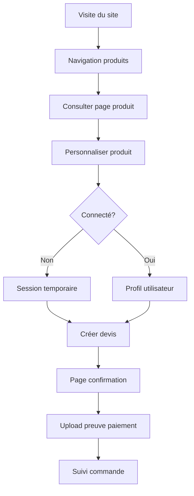
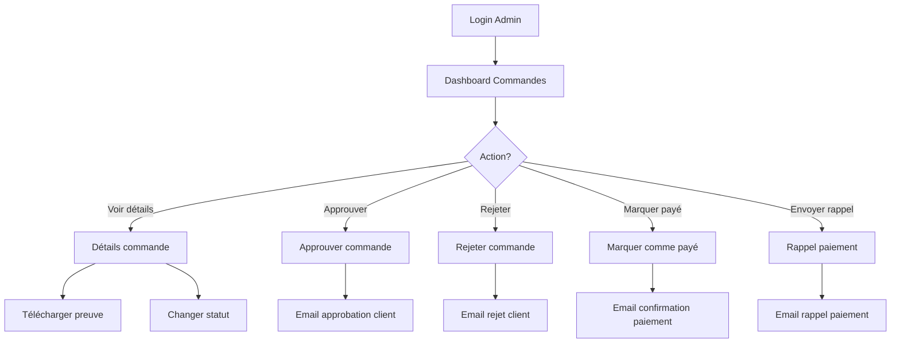
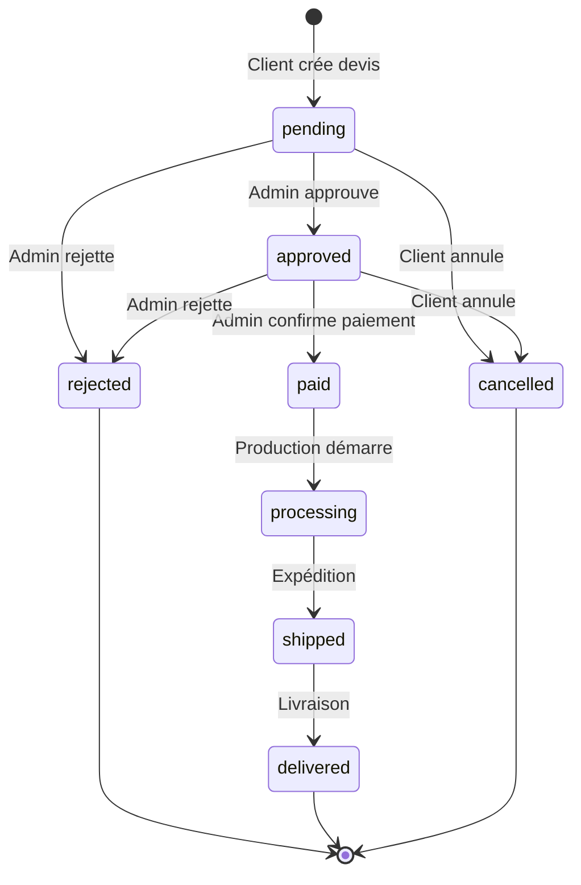

# 📊 Analyse Complète des Processus Client et Admin - ModusCap

> **Date**: 2025-11-19  
> **Auteur**: MiniMax Agent  
> **Objectif**: Documenter tous les workflows et identifier les manques

---

## 📋 Table des Matières

1. [Workflow Client (Frontend)](#workflow-client-frontend)
2. [Workflow Admin (Backend)](#workflow-admin-backend)
3. [Cycle de Vie d'une Commande](#cycle-de-vie-dune-commande)
4. [Système d'Emails Automatiques](#système-demails-automatiques)
5. [Problèmes Identifiés](#problèmes-identifiés)
6. [Fonctionnalités Manquantes](#fonctionnalités-manquantes)
7. [Recommandations](#recommandations)

---

## 1. Workflow Client (Frontend)

### 📝 Parcours d'un Client Non Connecté



### 🔍 Détails du Processus Client

#### Étape 1: Découverte et Navigation
**Route**: `/fr/` (HomePage)
- ✅ Consultation des modèles de maisons
- ✅ Filtres par surface, prix, chambres
- ✅ Voir les détails d'un produit

**Fichiers impliqués**:
- `FrontController::index()`
- `ProductController::index()`
- `templates/theme/default/products/index.html.twig`

#### Étape 2: Personnalisation Produit
**Route**: `/fr/products/{slug}`
- ✅ Voir les spécifications du produit
- ✅ Sélectionner des options (couleur, finitions, etc.)
- ✅ Définir la quantité
- ✅ Ajouter des notes de personnalisation
- ✅ Remplir informations client (nom, email, téléphone, adresse)

**Fichiers impliqués**:
- `ProductController::show()`
- `templates/theme/default/products/show.html.twig`

**🔴 PROBLÈME IDENTIFIÉ**:
```
La personnalisation est stockée en session mais il n'y a pas de 
contrôleur ProductController côté frontend qui gère la sauvegarde 
de la personnalisation en session !
```

**Session stockée**:
```php
$request->getSession()->set('product_customization', [
    'product_id' => $productId,
    'selected_options' => [...],
    'quantity' => 1,
    'customization_notes' => '...',
    'client_info' => [
        'name' => '...',
        'email' => '...',
        'phone' => '...',
        'address' => '...'
    ]
]);
```

#### Étape 3: Création du Devis
**Route**: `/fr/quote/create`
- ✅ Récupération de la personnalisation depuis la session
- ✅ Calcul du prix total (base + options × quantité)
- ✅ Affichage du récapitulatif
- ✅ Affichage des informations de paiement
- ✅ Validation et création de la commande (Order)

**Fichiers impliqués**:
- `QuoteController::create()`
- `PriceCalculatorService::calculateOrderItemPrice()`
- `templates/theme/default/quote/create.html.twig`

**Processus**:
1. Validation de la personnalisation en session
2. Vérification que le produit existe et est actif
3. Calcul des prix avec `PriceCalculatorService`
4. Affichage du formulaire de confirmation
5. Soumission → Création de l'Order
6. Suppression de la session
7. Redirection vers confirmation

#### Étape 4: Confirmation de Commande
**Route**: `/fr/quote/confirmation/{order_number}`
- ✅ Affichage du numéro de commande
- ✅ Détails de la commande (produits, prix, status)
- ✅ Informations de paiement (RIB, instructions)
- ✅ Formulaire d'upload de preuve de paiement

**Fichiers impliqués**:
- `QuoteController::confirmation()`
- `templates/theme/default/quote/confirmation.html.twig`

#### Étape 5: Upload Preuve de Paiement
**Route**: `/fr/quote/{order_number}/upload-payment` (POST)
- ✅ Validation du fichier (type: JPG, PNG, PDF)
- ✅ Vérification de la taille (max 5MB)
- ✅ Stockage dans `/public/uploads/payment_proofs/`
- ✅ Mise à jour de l'Order avec le nom du fichier

**Fichiers impliqués**:
- `QuoteController::uploadPaymentProof()`

**🟡 ATTENTION**:
```
Le client peut uploader une preuve de paiement mais l'admin 
doit MANUELLEMENT marquer la commande comme "paid".
Pas de notification automatique à l'admin quand un client 
upload une preuve de paiement.
```

#### Étape 6: Suivi de Commande
**Route**: `/fr/quote/{order_number}/track`
- ✅ Affichage du statut actuel
- ✅ Timeline de progression (pending → approved → paid → processing → shipped → delivered)
- ✅ Étapes complétées vs étapes en attente
- ✅ Raison de rejet (si rejeté)

**Fichiers impliqués**:
- `QuoteController::trackOrder()`
- `templates/theme/default/quote/track.html.twig`

**API Status**:
- `/fr/quote/{order_number}/status` → JSON avec status actuel

---

## 2. Workflow Admin (Backend)

### 🔧 Parcours d'un Administrateur



### 🔍 Détails du Processus Admin

#### Étape 1: Authentification Admin
**Route**: `/fr/login`
- ✅ Login avec email/password
- ✅ Redirection vers `/admin/dashboard` si ROLE_ADMIN
- ✅ Mise à jour du `lastLoginAt`

**Fichiers impliqués**:
- `AppAuthenticator::authenticate()`
- `AppAuthenticator::onAuthenticationSuccess()`

**🔴 PROBLÈME IDENTIFIÉ**:
```php
// Dans AppAuthenticator ligne 66 (AVANT correction)
return new RedirectResponse($this->urlGenerator->generate('admin_dashboard'));
```
**Status**: ✅ **Corrigé** - Redirection intelligente selon le rôle

#### Étape 2: Dashboard des Commandes
**Route**: `/admin/orders/`
- ✅ Liste de toutes les commandes
- ✅ Filtrage par status (pending, approved, paid, etc.)
- ✅ Recherche par numéro, nom, email client
- ✅ Tri par date, status, montant
- ✅ Statistiques (total commandes, montant, status)
- ✅ Alertes pour commandes nécessitant rappels de paiement

**Fichiers impliqués**:
- `OrderManagementController::index()`
- `templates/admin/orders/index.html.twig`

**Statistiques affichées**:
```php
[
    'total_orders' => 150,
    'total_revenue' => 450000.00,
    'pending_count' => 25,
    'approved_count' => 30,
    'paid_count' => 40,
    'processing_count' => 20,
    'shipped_count' => 15,
    'delivered_count' => 20
]
```

#### Étape 3: Détails d'une Commande
**Route**: `/admin/orders/{id}`
- ✅ Informations client (nom, email, téléphone, adresse)
- ✅ Produits commandés avec options
- ✅ Prix détaillé (base + options)
- ✅ Status actuel
- ✅ Dates (création, approbation, paiement)
- ✅ Preuve de paiement (si uploadée)
- ✅ Notes du client

**Fichiers impliqués**:
- `OrderManagementController::show()`
- `templates/admin/orders/show.html.twig`

#### Étape 4: Approuver une Commande
**Route**: `/admin/orders/{id}/approve` (POST)

**Conditions**:
- ✅ Status doit être `pending` ou `approved`
- ✅ Méthode: `Order::canBeApproved()`

**Actions automatiques**:
1. Change status → `approved`
2. Set `approvedBy` → User admin actuel
3. Set `approvedAt` → Date/heure actuelle
4. Clear `rejectionReason` (si existait)
5. **Envoi email au client** → `EmailService::sendOrderApproval()`

**Email envoyé**:
- ✅ Sujet: "Votre devis a été approuvé"
- ✅ Contenu: Instructions de paiement
- ✅ Informations bancaires
- ✅ Lien de tracking

**Fichiers impliqués**:
- `OrderManagementController::approve()`
- `EmailService::sendOrderApproval()`
- `templates/emails/order_approval.html.twig`

#### Étape 5: Rejeter une Commande
**Route**: `/admin/orders/{id}/reject` (POST)

**Conditions**:
- ✅ Status doit être `pending` ou `approved`
- ✅ Raison de rejet **obligatoire**

**Actions automatiques**:
1. Change status → `rejected`
2. Set `rejectionReason` → Texte fourni par admin
3. Set `approvedBy` → User admin actuel
4. **Envoi email au client** → `EmailService::sendOrderRejection()`

**Email envoyé**:
- ✅ Sujet: "Votre devis a été rejeté"
- ✅ Contenu: Raison du rejet
- ✅ Invitation à nous contacter

**🟡 ATTENTION**:
```
Une commande rejetée ne peut plus être approuvée.
Il faudrait ajouter une méthode pour "réouvrir" une commande rejetée.
```

**Fichiers impliqués**:
- `OrderManagementController::reject()`
- `EmailService::sendOrderRejection()`

#### Étape 6: Marquer comme Payé
**Route**: `/admin/orders/{id}/mark-paid` (POST)

**Conditions**:
- ✅ Preuve de paiement doit être uploadée
- ✅ Méthode: Vérification de `$order->getPaymentProof()`

**Actions automatiques**:
1. Change status → `paid`
2. Set `paidAt` → Date/heure actuelle
3. **Envoi email au client** → `EmailService::sendPaymentConfirmation()`

**Email envoyé**:
- ✅ Sujet: "Paiement confirmé"
- ✅ Contenu: Confirmation de réception du paiement
- ✅ Prochaines étapes (fabrication)

**🔴 PROBLÈME IDENTIFIÉ**:
```
L'admin doit vérifier MANUELLEMENT si une preuve de paiement 
a été uploadée. Il n'y a pas de notification automatique.

SOLUTION RECOMMANDÉE: Ajouter une notification sur le dashboard 
pour les commandes avec preuve uploadée mais status != paid.
```

**Fichiers impliqués**:
- `OrderManagementController::markAsPaid()`
- `EmailService::sendPaymentConfirmation()`

#### Étape 7: Envoyer Rappel de Paiement
**Route**: `/admin/orders/{id}/send-reminder` (POST)

**Conditions**:
- ✅ Méthode: `Order::canSendPaymentReminder()`
- ✅ Status doit être `approved` (non payé)

**Actions**:
- ✅ Envoi email de rappel
- ✅ **Pas de modification du status**

**Email envoyé**:
- ✅ Sujet: "Rappel de paiement"
- ✅ Contenu: Informations bancaires
- ✅ Montant à payer
- ✅ Lien pour uploader la preuve

**Fichiers impliqués**:
- `OrderManagementController::sendPaymentReminder()`
- `EmailService::sendPaymentReminder()`

#### Étape 8: Actions en Masse
**Route**: `/admin/orders/bulk-action` (POST)

**Actions disponibles**:
- ✅ `approve` → Approuver plusieurs commandes
- ✅ `reject` → Rejeter plusieurs commandes (raison générique)
- ✅ `send_reminders` → Envoyer rappels de paiement

**Processus**:
1. Sélection multiple via checkboxes
2. Choix de l'action
3. Application à toutes les commandes sélectionnées
4. Rapport de réussite/échec

**🟡 ATTENTION**:
```
Le rejet en masse utilise une raison générique.
Il serait mieux de demander une raison personnalisée.
```

#### Étape 9: Télécharger Preuve de Paiement
**Route**: `/admin/orders/{id}/download-payment-proof` (GET)

**Processus**:
- ✅ Vérification que le fichier existe
- ✅ Chemin: `/public/uploads/payment_proofs/{filename}`
- ✅ Téléchargement direct du fichier

#### Étape 10: Changer le Status Manuellement
**Route**: `/admin/orders/{id}/update-status` (POST)

**Status disponibles**:
- `pending` → En attente
- `approved` → Approuvé
- `rejected` → Rejeté
- `paid` → Payé
- `processing` → En production
- `shipped` → Expédié
- `delivered` → Livré
- `cancelled` → Annulé

**Format**: JSON API
```json
{
  "status": "processing"
}
```

**Réponse**:
```json
{
  "success": true,
  "message": "Status mis à jour",
  "order": {
    "id": 123,
    "order_number": "MOD-2025-001",
    "status": "processing",
    "updated_at": "2025-11-19 09:30:00"
  }
}
```

**🔴 PROBLÈME IDENTIFIÉ**:
```
Cette méthode permet de changer DIRECTEMENT le status sans 
vérifications ni emails. Elle contourne toutes les validations.

RECOMMANDATION: Limiter cette API aux transitions valides 
et ajouter des emails automatiques selon le changement.
```

#### Étape 11: Export des Commandes
**Route**: `/admin/orders/export` (POST)

**Filtres disponibles**:
- ✅ Par status
- ✅ Par période (date_from → date_to)

**Format**: CSV
```csv
"Numéro","Nom Client","Email","Téléphone","Status","Montant","Date"
"MOD-2025-001","Jean Dupont","jean@example.com","+33612345678","paid","45000.00","2025-11-19 10:00:00"
```

---

## 3. Cycle de Vie d'une Commande

### 📊 États et Transitions



### 📝 Description des États

| Status | Description | Actions Client | Actions Admin | Emails |
|--------|-------------|----------------|---------------|--------|
| **pending** | Devis créé, en attente validation | • Voir status<br>• Annuler | • Approuver<br>• Rejeter<br>• Voir détails | - |
| **approved** | Devis approuvé, attente paiement | • Upload preuve<br>• Annuler | • Marquer payé<br>• Rejeter<br>• Rappel paiement | ✉️ Approbation |
| **rejected** | Devis rejeté | • Voir raison | • Voir détails | ✉️ Rejet |
| **paid** | Paiement confirmé | • Suivre production | • Démarrer production | ✉️ Confirmation paiement |
| **processing** | En cours de fabrication | • Suivre production | • Mettre à jour status | - |
| **shipped** | Expédié | • Suivre livraison | • Confirmer livraison | - |
| **delivered** | Livré | • Confirmation réception | - | - |
| **cancelled** | Annulé | - | - | - |

---

## 4. Système d'Emails Automatiques

### 📧 Emails Disponibles

| Événement | Template | Destinataire | Envoyé par | Contenu |
|-----------|----------|--------------|------------|---------|
| **Inscription utilisateur** | `registration_confirmation.html.twig` | Client | `EmailService::sendRegistrationConfirmation()` | • Bienvenue<br>• Lien profil |
| **Contact formulaire** | `contact_notification.html.twig` | Admin | `EmailService::sendContactNotification()` | • Nouveau message<br>• Coordonnées client |
| **Confirmation contact** | `contact_confirmation.html.twig` | Client | `EmailService::sendContactConfirmation()` | • Accusé réception<br>• Délai de réponse |
| **Approbation devis** | `order_approval.html.twig` | Client | `EmailService::sendOrderApproval()` | • Devis approuvé<br>• Infos paiement |
| **Rejet devis** | `order_rejection.html.twig` | Client | `EmailService::sendOrderRejection()` | • Devis rejeté<br>• Raison |
| **Confirmation paiement** | `payment_confirmation.html.twig` | Client | `EmailService::sendPaymentConfirmation()` | • Paiement reçu<br>• Prochaines étapes |
| **Rappel paiement** | `payment_reminder.html.twig` | Client | `EmailService::sendPaymentReminder()` | • Rappel<br>• Infos bancaires |
| **Confirmation commande** | `order_confirmation.html.twig` | Client | `EmailService::sendOrderConfirmation()` | • Récap commande<br>• Numéro suivi |

### 🔴 Emails Manquants (Recommandés)

| Événement | Destinataire | Raison |
|-----------|--------------|--------|
| **Nouvelle commande créée** | Admin | Notification en temps réel |
| **Preuve paiement uploadée** | Admin | Alerte pour vérification |
| **Commande annulée** | Admin + Client | Confirmation annulation |
| **Statut changé en "processing"** | Client | Info production démarrée |
| **Statut changé en "shipped"** | Client | Numéro de suivi livraison |
| **Statut changé en "delivered"** | Client | Demande confirmation réception |
| **Délai paiement dépassé** | Client + Admin | Rappel automatique après X jours |

---

## 5. Problèmes Identifiés

### 🔴 Problèmes Critiques

#### 1. Pas de Sauvegarde de Personnalisation Frontend
**Fichier manquant**: `ProductController` côté frontend (ou route dans `FrontController`)

**Problème**:
```php
// La personnalisation doit être stockée en session AVANT de rediriger vers /quote/create
// Mais il n'y a PAS de route POST pour sauvegarder la personnalisation !
```

**Localisation du problème**:
- Template: `templates/theme/default/products/show.html.twig`
- Formulaire de personnalisation présent ✅
- Mais pas de route pour soumettre le formulaire ❌

**Solution requise**:
```php
// À ajouter dans FrontController ou ProductController
#[Route('/{_locale}/products/{slug}/customize', name: 'app_product_customize', methods: ['POST'])]
public function customize(Request $request, string $slug): Response
{
    // 1. Récupérer le produit
    // 2. Valider les options sélectionnées
    // 3. Stocker en session
    // 4. Rediriger vers /quote/create
}
```

#### 2. Pas de Notification Admin Upload Preuve Paiement
**Problème**:
Quand un client upload une preuve de paiement, l'admin n'est **pas notifié**. Il doit vérifier manuellement.

**Solution requise**:
```php
// Dans QuoteController::uploadPaymentProof()
// Après ligne 219
$this->emailService->sendPaymentProofUploadedNotification($order, 'admin@moduscap.com');
```

#### 3. API updateStatus Sans Validation
**Fichier**: `OrderManagementController::updateStatus()`
**Ligne**: 292-323

**Problème**:
```php
// Permet de changer n'importe quel status sans vérifications
$order->setStatus($newStatus);
```

**Risques**:
- Passer de `pending` à `delivered` directement
- Pas d'emails envoyés
- Pas de mise à jour des dates (approvedAt, paidAt, etc.)

**Solution**:
```php
// Valider les transitions autorisées
$allowedTransitions = [
    'pending' => ['approved', 'rejected', 'cancelled'],
    'approved' => ['paid', 'rejected', 'cancelled'],
    'paid' => ['processing'],
    // etc.
];

if (!in_array($newStatus, $allowedTransitions[$order->getStatus()] ?? [])) {
    return new JsonResponse(['error' => 'Transition invalide'], 400);
}

// Envoyer les emails appropriés selon la transition
```

### 🟡 Problèmes Modérés

#### 4. Rejet en Masse avec Raison Générique
**Fichier**: `OrderManagementController::bulkAction()`
**Ligne**: 238

```php
$order->setRejectionReason($this->translator->trans('admin.errors.order.bulk_rejected_reason'));
```

**Problème**: Toutes les commandes rejetées en masse ont la même raison

**Solution**: Modal pour demander une raison personnalisée

#### 5. Pas de Réouverture de Commande Rejetée
**Problème**: Une fois rejetée, une commande ne peut plus être approuvée

**Solution**:
```php
#[Route('/{id}/reopen', name: 'admin_order_reopen', methods: ['POST'])]
public function reopen(Order $order): Response
{
    if ($order->getStatus() !== Order::STATUS_REJECTED) {
        throw new \Exception('Seules les commandes rejetées peuvent être réouvertes');
    }
    
    $order->setStatus(Order::STATUS_PENDING);
    $order->setRejectionReason(null);
    $this->entityManager->flush();
    
    return $this->redirectToRoute('admin_order_show', ['id' => $order->getId()]);
}
```

#### 6. Pas de Limite de Rappels de Paiement
**Problème**: Un admin peut envoyer des rappels de paiement infinis

**Solution**: Ajouter un compteur de rappels
```php
// Dans Order entity
private int $paymentRemindersCount = 0;

// Dans OrderManagementController::sendPaymentReminder()
if ($order->getPaymentRemindersCount() >= 3) {
    $this->addFlash('error', 'Limite de rappels atteinte (3 max)');
    return $this->redirectToRoute('admin_orders_index');
}

$order->incrementPaymentRemindersCount();
```

---

## 6. Fonctionnalités Manquantes

### 🚀 Fonctionnalités Importantes

#### 1. Espace Client Personnel
**Actuellement**: Pas d'espace client pour suivre ses commandes

**Recommandation**:
```php
#[Route('/{_locale}/my-orders', name: 'app_user_orders')]
public function myOrders(): Response
{
    $user = $this->getUser();
    // Lier les commandes à l'utilisateur via email
    $orders = $this->entityManager->getRepository(Order::class)
        ->findBy(['clientEmail' => $user->getEmail()]);
    
    return $this->render('@theme/user/orders.html.twig', [
        'orders' => $orders
    ]);
}
```

#### 2. Annulation de Commande Client
**Actuellement**: Pas de route pour annuler une commande

**Recommandation**:
```php
#[Route('/{_locale}/quote/{order_number}/cancel', name: 'app_quote_cancel', methods: ['POST'])]
public function cancel(string $orderNumber): Response
{
    $order = // ...récupérer commande
    
    if (!in_array($order->getStatus(), [Order::STATUS_PENDING, Order::STATUS_APPROVED])) {
        throw new \Exception('Cette commande ne peut plus être annulée');
    }
    
    $order->setStatus(Order::STATUS_CANCELLED);
    $this->emailService->sendOrderCancellation($order);
    
    return $this->redirectToRoute('app_quote_track', ['order_number' => $orderNumber]);
}
```

#### 3. Notifications Dashboard Admin
**Recommandation**:
- Badge "X nouvelles commandes"
- Badge "X preuves de paiement à vérifier"
- Badge "X rappels à envoyer"

#### 4. Historique des Actions Admin
**Recommandation**: Log de toutes les actions admin sur une commande
```php
// Nouvelle entité OrderLog
- admin_user_id
- order_id
- action (approved, rejected, status_changed, etc.)
- old_value
- new_value
- created_at
```

#### 5. Relance Automatique après X Jours
**Recommandation**: Cron job pour relances automatiques
```php
// Command Symfony
php bin/console app:send-payment-reminders

// Envoie automatiquement un rappel aux commandes:
// - Status = approved
// - approvedAt + 7 jours < maintenant
// - paymentRemindersCount < 3
```

#### 6. PDF du Devis
**Recommandation**: Générer un PDF téléchargeable
```php
#[Route('/{order_number}/download-pdf', name: 'app_quote_download_pdf')]
public function downloadPdf(string $orderNumber): Response
{
    $order = // ...
    $pdf = $this->pdfGenerator->generateQuotePdf($order);
    
    return new Response($pdf, 200, [
        'Content-Type' => 'application/pdf',
        'Content-Disposition' => 'attachment; filename="devis-'.$orderNumber.'.pdf"'
    ]);
}
```

---

## 7. Recommandations

### ✅ Priorité 1 (Urgent - Bloquants)

1. **Créer route de personnalisation produit** (Frontend)
   - Fichier: `src/Controller/FrontController.php` ou nouveau `ProductController.php`
   - Route: `POST /{_locale}/products/{slug}/customize`
   - Fonction: Sauvegarder personnalisation en session

2. **Ajouter notification upload preuve paiement** (Admin)
   - Email automatique à admin quand client upload preuve
   - Badge sur dashboard des commandes avec preuve non vérifiée

3. **Sécuriser l'API updateStatus**
   - Valider les transitions de status
   - Ajouter emails automatiques
   - Mettre à jour les dates appropriées

### ⚡ Priorité 2 (Important - Améliorations)

4. **Espace client "Mes Commandes"**
   - Liste des commandes du client connecté
   - Suivi en temps réel

5. **Permettre annulation commande client**
   - Conditions: status = pending ou approved
   - Email de confirmation

6. **Réouverture commandes rejetées**
   - Nouvelle route admin pour remettre en pending

7. **PDF téléchargeable du devis**
   - Générer PDF avec tous les détails
   - Téléchargement client et admin

### 🔧 Priorité 3 (Nice to have - Optimisations)

8. **Historique actions admin**
   - Log de toutes les modifications
   - Traçabilité complète

9. **Relance automatique paiement**
   - Cron job quotidien
   - Rappels automatiques après 7, 14, 21 jours

10. **Dashboard statistiques avancées**
    - Graphiques de commandes par mois
    - Taux de conversion
    - Revenus par produit

---

## 📊 Tableau Récapitulatif

| Fonctionnalité | Status | Urgence | Action Requise |
|----------------|--------|---------|----------------|
| Workflow client de base | ✅ OK | - | - |
| Personnalisation produit (POST) | ❌ MANQUANT | 🔴 Critique | Créer route |
| Création devis | ✅ OK | - | - |
| Upload preuve paiement | ✅ OK | - | - |
| Notification upload preuve | ❌ MANQUANT | 🔴 Critique | Ajouter email |
| Suivi commande | ✅ OK | - | - |
| Dashboard admin | ✅ OK | - | - |
| Approbation commande | ✅ OK | - | - |
| Rejet commande | ✅ OK | - | - |
| Marquer comme payé | ✅ OK | - | - |
| Rappel paiement | ✅ OK | - | - |
| API updateStatus | ⚠️ NON SÉCURISÉ | 🔴 Critique | Sécuriser |
| Réouverture commande | ❌ MANQUANT | 🟡 Important | Créer route |
| Annulation client | ❌ MANQUANT | 🟡 Important | Créer route |
| Espace "Mes commandes" | ❌ MANQUANT | 🟡 Important | Créer page |
| PDF devis | ❌ MANQUANT | 🟢 Nice to have | Intégrer lib PDF |
| Historique actions | ❌ MANQUANT | 🟢 Nice to have | Nouvelle entité |
| Relances automatiques | ❌ MANQUANT | 🟢 Nice to have | Command Symfony |

---

## 📝 Conclusion

Le projet dispose d'un **workflow complet et fonctionnel** pour la gestion des commandes, mais présente **3 problèmes critiques** à corriger en priorité :

1. ❌ **Route de personnalisation produit manquante**
2. ❌ **Pas de notification admin upload preuve**
3. ⚠️ **API updateStatus non sécurisée**

Une fois ces corrections appliquées, le système sera **prêt pour la production** avec les fonctionnalités de base. Les améliorations de priorité 2 et 3 peuvent être ajoutées progressivement.

---

**Prochaine étape recommandée**: Créer les routes manquantes critiques et sécuriser l'API updateStatus.
